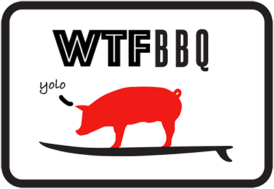

## Sinatra Boilerplate for WTFBBQ Example!

* Clone this repository!
* Run the migrations script!
* `bundle`
* `rackup`
* Enjoy!

## How do we add controllers?

1. Controllers need to be in a `/controllers` folder.
2. Name each controller after the resource it represents (hint: ActiveRecord Model names == Controller names)
3. The controller class should be ResourcenameController
4. `/controllers/resource.rb`
5. Each controller should inherit from ApplicationController
6. In our config.ru, we need to:
  - require the controller - `require './controllers/resource'`
  - require any model (or helpers) the controller needs
  - map a resource (route) to a controller - `map('/resource') { run ResourcenameController }`
